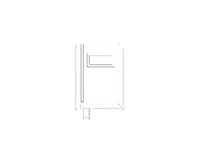

# SURVIVOR RECORDS 지후 - Alex
# <a href="https://github.com/Allegsu/alex_portfolio"></img></a>

<strong style="color:white">Sup Mates!</strong> If you've made it here, it <strong style="color:white">means</strong> you're <strong style="color:white">curious</strong> to know more <strong style="color:white">about me </strong>and how to reach me. I'd be happy to connect! Press the <strong style="color:white">"X" button</strong> to <strong style="color:white">open the records</strong>, or hit <strong style="color:white">"O"</strong> to head <strong style="color:white">back</strong> to my main <strong style="color:white">GitHub profile.</strong>

<a href="https://Allegsu.github.io/alex_portfolio"></img>OPEN PORTFOLIO</a>
<a href="https://github.com/Allegsu"></img>BACK<a>

